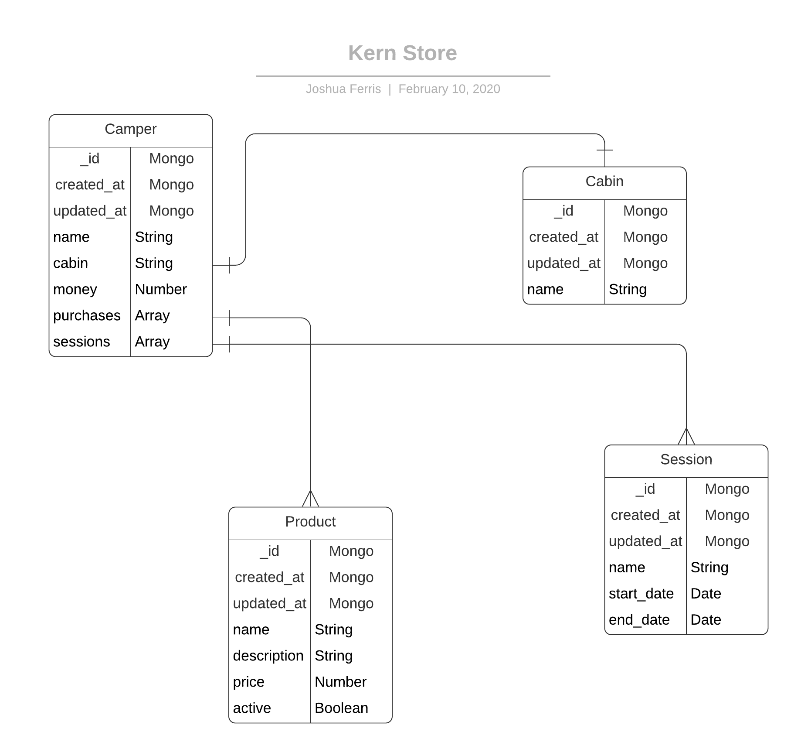

# Todo

## Server

* [x] Eslint
* [] Server Framework
  * [x] koa, koa-router, koa-helmet, koa-body, @koa/cors, koa-logger
  * [] basic api
* [] Authentication
  * [] Password sent
  * [] JWT Returned (12 hours)
  * [] Verify middleware for operations below
* [] Campers Operations
  * [] Add a camper
  * [] Remove a camper
  * [] Edit a camper
  * [] List campers
  * [] View a camper
* [] Cabins Operations
  * [] Add a cabin
  * [] Remove a cabin
  * [] Edit a cabin
  * [] List cabins
  * [] View a cabin
* [] Sessions Operations
  * [] Add a session
  * [] Remove a session
  * [] Edit a session
  * [] List sessions
  * [] View a session
* [] Products Operations
  * [] Add a product
  * [] Remove a product
  * [] Edit a product
  * [] List products
  * [] View a product

## Client
* [] Landing/Login Page
* [] Management Page
  * [] Camper Section
  * [] Cabin Section
  * [] Product Section
* [] POS Page
